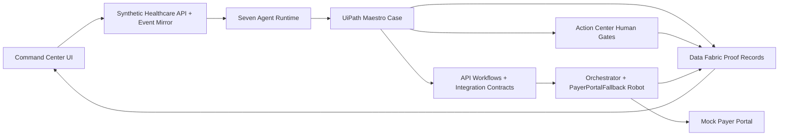

# Treatment Access Command Center

## Project Description

Treatment Access Command Center is a **UiPath AgentHack 2026** submission for
**Track 1: UiPath Maestro Case / Agentic Case Management**. It turns
specialty-medication prior authorization into a governed treatment-access case:
agents assemble the evidence and payer work, UiPath orchestrates the lifecycle,
and humans approve clinical risk before payer-facing action.

The problem is healthcare coordination. Prior authorization is not just one
form; it is payer policy, chart evidence, clinician attestation, payer channel
failure, denial rescue, appeal work, and pharmacy handoff spread across separate
systems. Access teams lose time rebuilding context, clinicians are asked to
approve unsupported language, and patients wait for therapy.

Treatment Access Command Center reframes that workflow as a Maestro-governed
case:

```text
synthetic treatment order -> policy criteria -> evidence matrix -> clinician gate
  -> payer submission route -> portal fallback -> denial rescue -> appeal packet
  -> pharmacy handoff -> UiPath proof trail
```

The repository contains the runnable local product experience, synthetic
healthcare API, mock payer portal, seven-agent runtime, UiPath artifacts,
verification scripts, final deck, demo script, and live UiPath proof closeout
needed to review or reproduce the submission.

## At A Glance

| Area                | Summary                                                                                                                |
| ------------------- | ---------------------------------------------------------------------------------------------------------------------- |
| Primary user        | Specialty-medication access coordinators, clinicians, and revenue-cycle teams.                                         |
| Core value          | Reduces manual prior-auth assembly, prevents unsupported submissions, and turns denials into structured recovery work. |
| Main workflow       | Case intake -> policy review -> evidence mapping -> human approval -> payer route -> exception handling -> appeal.     |
| Agentic layer       | Seven specialist agents prepare policy, evidence, packet, denial, appeal, and care-continuity outputs.                 |
| UiPath layer        | Maestro, Action Center, API Workflows, Data Fabric, Orchestrator, RPA, and Solutions govern the case.                  |
| Judge-facing proof  | Local product flow plus live UiPath records, task/job identifiers, final deck, demo script, and setup checks.          |
| Data and compliance | Synthetic-only healthcare data, no real PHI, no real payer submission, and explicit clinician gates.                   |

## Why It Matters

Specialty-medication access is time-sensitive. The AMA has reported that
physicians and staff spend about **13 hours per week** on prior authorization,
with roughly **40 requests per physician per week**. Treatment Access Command
Center is designed for the access coordinator who needs to know:

- which patient is stuck,
- why the case is at risk,
- what evidence supports each payer requirement,
- which claims still need clinician approval,
- whether the payer channel is working,
- how to recover from denial without starting over.

The product promise is simple:

```text
AI assembles.
UiPath governs.
Humans approve.
```

## Architecture Snapshot



## UiPath Components

| UiPath component                        | Role in Treatment Access Command Center                                                                                                               | Repository / live evidence                                                                                                                                  |
| --------------------------------------- | ----------------------------------------------------------------------------------------------------------------------------------------------------- | ----------------------------------------------------------------------------------------------------------------------------------------------------------- |
| **Maestro Case**                        | Coordinates the treatment-access lifecycle across intake, policy check, evidence mapping, signoff, submission, denial, appeal, approval, and handoff. | `uipath/maestro/`, `uipath/solution/treatment-access-command-center/TreatmentAccessCase/`, live case debug noted in `docs/live-uipath-proof-closeout.md`.   |
| **Maestro Flow / HITL**                 | Models the clinician-validation boundary and human-task handoff.                                                                                      | `uipath/solution/treatment-access-command-center/resources/solution_folder/process/flow/ClinicianValidationFlow.json`; live flow reached the HITL boundary. |
| **Agent Builder / UiPath Agents**       | Defines seven specialist agents for coverage, evidence, missing evidence, submission packet, denial rescue, appeal packet, and care continuity.       | `uipath/agents/**`, local validation artifacts, visible agent traces in the Command Center.                                                                 |
| **Coded Agents / coded runtime**        | Implements the testable TypeScript agent runtime and shared contracts for source-grounded outputs.                                                    | `packages/agent-runtime`, `packages/shared-schemas`, `CI=true pnpm smoke:agents`.                                                                           |
| **Action Center**                       | Holds clinician attestation and appeal signoff patterns so clinical accountability stays human-owned.                                                 | Live ExternalTask `4401667` was created, assigned, completed, and read back with synthetic clinician-attestation output.                                    |
| **API Workflows / Integration Service** | Represents EHR hydration, payer submission/status, pharmacy handoff, and event-write contracts.                                                       | `uipath/api-workflows/`, `uipath/solution/treatment-access-command-center/resources/solution_folder/process/`.                                              |
| **Data Fabric / Data Service**          | Stores proof events and synthetic case state in the UiPath folder.                                                                                    | Live folder-scoped `TreatmentAccessProofEvent` entity and proof records in `TreatmentAccessHackathon`.                                                      |
| **Orchestrator**                        | Owns runtime governance, folder/process visibility, machine assignment, and robot job proof.                                                          | Successful live Development-runtime job `6d9b9fa9-f582-4983-98fa-167e87d57f2a`.                                                                             |
| **RPA / Assistant Robot**               | Provides the `PayerPortalFallback` process for payer API unavailable scenarios.                                                                       | `uipath/robots/`, solution-packaged process, successful Orchestrator job. Current XAML is scaffold-only, so captured portal UIA is not claimed.             |
| **Solutions**                           | Packages, deploys, and activates the UiPath project boundary.                                                                                         | Published, deployed, and activated as `treatment-access-command-center@1.0.20260629`.                                                                       |
| **Apps / Action App contracts**         | Defines the intended intake and human-review surfaces for production handoff.                                                                         | `uipath/apps/`, `uipath/action-center/`.                                                                                                                    |
| **IXP / Document Understanding path**   | Production extraction target for policies, chart notes, labs, and denial letters.                                                                     | `uipath/agents/extraction/`; local source-span parser preserves the same evidence contract with synthetic data.                                             |
| **UiPath for Coding Agents / Codex**    | Used to build, checkpoint, test, and integrate the product through structured coding-agent workflows.                                                 | `.agents/skills`, orchestration logs, checkpoint docs, and committed implementation history.                                                                |

Submission environment references:

```text
Organizer-requested UiPath Labs field URL: https://staging.uipath.com/hackathon26_244/
Verified Automation Cloud proof tenant URL: https://cloud.uipath.com/galacticus/DefaultTenant/
Organization: galacticus
Tenant: DefaultTenant
Folder: TreatmentAccessHackathon
Folder ID: 7986316
Folder key: 4fba2fa1-012b-469a-b6aa-e5be3811c173
```

If the organizer-provided UiPath Labs email shows a different
`hackathon26_###` URL, use that exact Labs URL in the Devpost field. The
`cloud.uipath.com` tenant URL above is the verified live proof tenant reached by
the UiPath CLI and Automation Cloud records.

Legacy/tenant deep link used by live proof records:

```text
https://cloud.uipath.com/galacticus/DefaultTenant/
```

## Agent Type

This solution uses **both low-code Agent Builder-style agents and coded
agents**.

- **Low-code Agent Builder-style agents:** seven UiPath agent packet folders,
  contracts, sample outputs, entry points, and validation artifacts live under
  `uipath/agents/**`.
- **Coded agents:** the TypeScript runtime in `packages/agent-runtime` uses
  shared Zod schemas to produce local, repeatable coverage, evidence,
  missing-evidence, submission, denial, appeal, and care-continuity outputs.
- **Governed execution pattern:** the custom React UI visualizes case state, but
  UiPath remains the orchestration and governance layer for cases, human gates,
  records, solution lifecycle, robot jobs, and audit proof.

## Seven-Agent Workflow

| Agent                      | Responsibility                                                                               |
| -------------------------- | -------------------------------------------------------------------------------------------- |
| Coverage Requirement Agent | Turns payer policy into criteria, documents, channels, and citations.                        |
| Evidence Retrieval Agent   | Maps chart artifacts to payer criteria with source spans, confidence, and review flags.      |
| Missing Evidence Agent     | Finds blocking gaps and prepares the human task needed to resolve them.                      |
| Submission Packet Agent    | Builds payer packet fields and attachments only after evidence and approval gates are ready. |
| Denial Rescue Agent        | Classifies denial/RFI reasons and selects the recovery strategy.                             |
| Appeal Packet Agent        | Drafts administrative appeal language with citations and warnings for clinician review.      |
| Care Continuity Agent      | Prepares pharmacy, scheduling, and care-team handoff after approval.                         |

## Live Proof And Boundaries

The final live UiPath proof is recorded in
[`docs/live-uipath-proof-closeout.md`](docs/live-uipath-proof-closeout.md).

| Proof area         | What is live / verified                                                                                       | Boundary                                                                                                   |
| ------------------ | ------------------------------------------------------------------------------------------------------------- | ---------------------------------------------------------------------------------------------------------- |
| Data Fabric        | Live entity `TreatmentAccessProofEvent` and synthetic proof records under `TreatmentAccessHackathon`.         | Synthetic only; no real PHI.                                                                               |
| Action Center      | ExternalTask `4401667` created, assigned, completed, and read back with synthetic clinician-attestation data. | Demonstrates human gate pattern; no real patient review.                                                   |
| Solutions          | Package `treatment-access-command-center@1.0.20260629` published, deployed, and activated.                    | Deployed for hackathon proof, not production healthcare use.                                               |
| Orchestrator / RPA | Job `6d9b9fa9-f582-4983-98fa-167e87d57f2a` completed successfully.                                            | Current robot XAML is scaffold-only; captured browser portal UI automation is a production-hardening step. |
| Maestro            | Case and flow debug reached the human-task boundary.                                                          | Inline HITL app binding did not complete end-to-end and is not overclaimed.                                |
| Payer submission   | Local synthetic payer API and mock portal demonstrate routing.                                                | No real payer submission, credential use, or external payer portal interaction.                            |

## Setup Instructions For Judges

### 1. Clone the public repository

```bash
git clone https://github.com/AbhinavGupta707/Treatment-Access.git
cd Treatment-Access
```

### 2. Install prerequisites

- Node.js 22+
- pnpm 11+
- Git
- Optional for live platform inspection: UiPath CLI authenticated to
  `galacticus / DefaultTenant`
- Optional for live provider mode: Fireworks and LangSmith keys in local,
  git-ignored environment files

### 3. Install dependencies

```bash
CI=true pnpm install
```

### 4. Verify setup

```bash
CI=true pnpm verify:setup
CI=true pnpm smoke:checkpoint8-live-uipath
```

For the full local suite:

```bash
CI=true pnpm verify
```

### 5. Start the product surfaces

Run these in separate terminals:

```bash
CI=true pnpm dev:api
CI=true pnpm dev:command-center
CI=true pnpm dev:mock-payer
```

| Surface             | Default URL             | Purpose                                                    |
| ------------------- | ----------------------- | ---------------------------------------------------------- |
| Mock Healthcare API | `http://127.0.0.1:8787` | Synthetic EHR, payer, pharmacy, toggles, and event mirror. |
| Command Center      | `http://127.0.0.1:5173` | Main judge-facing product experience.                      |
| Mock Payer Portal   | `http://127.0.0.1:5174` | Synthetic portal used by the fallback route.               |

## Judge Demo Path

1. Open `http://127.0.0.1:5173`.
2. Start on **Dashboard** to see active cases, risk, clinician signoff load, and
   the urgent synthetic case.
3. Open **Cases** and inspect `TACC-2026-001`: treatment, payer, deadline,
   actors, progress, and recent activity.
4. Open **Evidence** and select the row marked `Needs Signoff` to see payer
   criteria, mapped evidence, confidence, source, and human-review gating.
5. Return to **Dashboard** and click **Start case orchestration** to show the
   Maestro-style case preparation journey.
6. Open **Submissions** to see the payer API unavailable branch and governed
   robot fallback route.
7. Open **Appeals** to see denial summary, referenced payer rule, appeal packet,
   supporting attachments, clinician attestation, and signoff.
8. Return to **Dashboard** and open **UiPath records** to inspect live proof
   identifiers and safety boundaries.

## Submission Assets

| Asset               | Location                                                                                                                        |
| ------------------- | ------------------------------------------------------------------------------------------------------------------------------- |
| Public repository   | `https://github.com/AbhinavGupta707/Treatment-Access`                                                                           |
| Presentation deck   | [`Treatment Access Command Center Submission Deck.pptx`](Treatment%20Access%20Command%20Center%20Submission%20Deck.pptx)        |
| Final demo script   | [`docs/demo-script-3min-final.md`](docs/demo-script-3min-final.md)                                                              |
| Devpost copy        | [`docs/devpost-copy.md`](docs/devpost-copy.md) and [`docs/devpost-project-story-final.md`](docs/devpost-project-story-final.md) |
| Live proof closeout | [`docs/live-uipath-proof-closeout.md`](docs/live-uipath-proof-closeout.md)                                                      |

The project was started during the hackathon window. The first repository commit
is dated **2026-06-28**, after the May 14, 2026 eligibility cutoff.

## Verification Commands

Recommended before judging or handoff:

```bash
CI=true pnpm verify:setup
CI=true pnpm format:check
CI=true pnpm seed
CI=true pnpm smoke:agents
CI=true pnpm smoke:checkpoint8-live-uipath
git diff --check
```

Full local verification:

```bash
CI=true pnpm typecheck
CI=true pnpm test
CI=true pnpm build
CI=true pnpm verify
```

## Safety And Privacy

- Synthetic data only.
- No real patient, payer, provider, credential, or PHI data.
- No real payer submission.
- Every clinical assertion must have source evidence, a policy citation, or
  human approval.
- Appeal language is an administrative draft for clinician review, not
  autonomous medical or legal advice.
- UiPath live side effects are documented only where live proof IDs exist.

## Repository Map

| Path                           | Purpose                                                               |
| ------------------------------ | --------------------------------------------------------------------- |
| `apps/command-center`          | Judge-facing Treatment Access cockpit.                                |
| `apps/mock-payer-portal`       | Synthetic payer portal for fallback demonstration.                    |
| `services/mock-healthcare-api` | Synthetic EHR, payer, pharmacy, toggles, and event mirror API.        |
| `packages/shared-schemas`      | Shared TypeScript/Zod contracts.                                      |
| `packages/demo-data`           | Synthetic patient, policy, evidence, denial, and event fixtures.      |
| `packages/agent-runtime`       | Deterministic coded-agent runtime and smoke path.                     |
| `uipath/maestro`               | Maestro case design and SDD.                                          |
| `uipath/agents`                | Agent Builder packet contracts and samples.                           |
| `uipath/api-workflows`         | API Workflow contracts and validation notes.                          |
| `uipath/action-center`         | Human approval task contracts and live proof packet.                  |
| `uipath/data-service`          | Data Fabric/Data Service entity and event contracts.                  |
| `uipath/robots`                | Payer portal fallback RPA project and runbooks.                       |
| `uipath/solution`              | UiPath solution shell and imported process resources.                 |
| `docs`                         | Demo, testing, setup, submission, live proof, and orchestration docs. |
| `scripts`                      | Setup, seed, reset, and smoke verification helpers.                   |

## Documentation

- [UiPath setup](docs/setup-uipath.md)
- [Testing](docs/testing.md)
- [Architecture](docs/architecture.md)
- [Submission package](docs/submission.md)
- [Final demo script](docs/demo-script-3min-final.md)
- [Live UiPath proof closeout](docs/live-uipath-proof-closeout.md)

## License

MIT. See [LICENSE](LICENSE).
