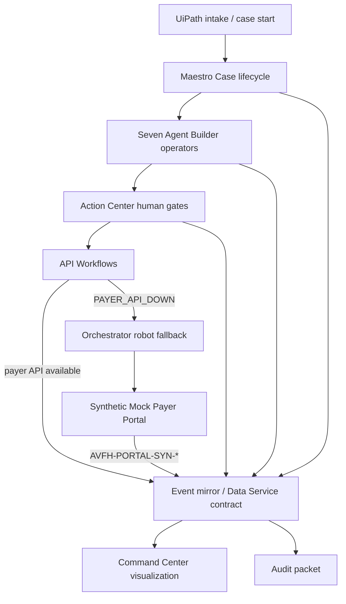

# Architecture

Treatment Access Command Center is a UiPath-governed case system for synthetic
specialty medication access. UiPath owns orchestration, approvals, robots,
agents, and audit events. The custom apps make the governed state visible; they
do not independently decide live case state.

## Layer Model

1. **UiPath orchestration and governance layer** - Maestro Case, Agent Builder,
   API Workflows, Action Center, Orchestrator, Data Service/Data Fabric design,
   solution shell, and Assistant/Robot.
2. **Agent operator layer** - seven domain agents with distinct structured
   outputs: Coverage Requirement, Evidence Retrieval, Missing Evidence,
   Submission Packet, Denial Rescue, Appeal Packet, and Care Continuity. An
   Audit Packet agent is also present as a cross-cutting audit artifact.
3. **Integration and fallback layer** - API Workflows call synthetic EHR, payer,
   pharmacy, and event endpoints. When the payer API path returns
   `PAYER_API_DOWN`, the intended UiPath path is an Orchestrator-owned robot
   fallback against the synthetic Mock Payer Portal.
4. **Mock system layer** - local synthetic EHR, payer, pharmacy, denial, portal,
   and event mirror APIs. These exist to prove the workflow safely without real
   patient, payer, provider, credential, or PHI data.
5. **Presentation layer** - Treatment Access Command Center and Mock Payer
   Portal. The Command Center reads case snapshots, agent traces, evidence
   mappings, human gates, submission attempts, robot fallback events, denial
   rescue output, care handoff state, and audit timeline records.
6. **Contract layer** - shared TypeScript/Zod schemas and deterministic
   fixtures used by custom apps, mock APIs, agent runtime checks, UiPath
   implementation packets, and smoke tests.

## System Flow

## UiPath Components

| Component                  | Role in the product                                                                              | Current truthful status                                                                                            |
| -------------------------- | ------------------------------------------------------------------------------------------------ | ------------------------------------------------------------------------------------------------------------------ |
| Maestro Case               | Owns the case lifecycle, stages, exception paths, and work handoffs.                             | Case design artifacts exist. Live debug/run remains approval-gated.                                                |
| Agent Builder              | Hosts seven specialized operators with schema-bounded outputs and trace/audit envelopes.         | Local Agent Builder packets and deterministic runtime smoke exist. Live Agent Builder debug/run is approval-gated. |
| API Workflows              | Pull EHR/order data, call payer/pharmacy/event endpoints, and write event records.               | Static workflow artifacts and local mock contracts exist. Side-effecting live runs require approval.               |
| Action Center              | Captures clinician evidence validation, missing evidence review, appeal signoff, and exceptions. | Task schemas and sample payloads exist. Live task creation/completion is approval-gated.                           |
| Orchestrator               | Governs folders, jobs, assets, logs, and the robot fallback execution path.                      | Folder and runtime discovery have been verified. Job start is approval-gated.                                      |
| Assistant/Robot            | Executes portal fallback against the synthetic payer portal when the API channel is down.        | Robot contract and setup notes exist. A real RPA project/run depends on the local Studio/.NET prerequisite.        |
| Data Service/Data Fabric   | Intended durable case/event record system for live UiPath-written state.                         | Data model artifacts exist. Live writes are approval-gated.                                                        |
| IXP/Document Understanding | Preferred extraction path for policy and denial documents when available.                        | IXP command surface is not currently registered locally; fallback parser preserves schema-compatible source spans. |
| Solution                   | Bundles UiPath projects for Studio Web/deployment lifecycle.                                     | Solution shell exists. Upload, publish, deploy, and activation are approval-gated.                                 |

## Seven-Agent Operating Model

| Agent                | Owns                                                                             | Writes or returns                                                                       |
| -------------------- | -------------------------------------------------------------------------------- | --------------------------------------------------------------------------------------- |
| Coverage Requirement | Payer authorization requirements, policy criteria, required documents, channels. | `authorization_required`, `criteria[]`, `required_documents[]`, `policy_citations[]`.   |
| Evidence Retrieval   | Mapping synthetic chart artifacts to each criterion.                             | evidence matrix rows, source references, confidence, missing/conflicting flags.         |
| Missing Evidence     | Blocking gaps and human work requests.                                           | missing evidence gates, role assignment, task prompt, due date, SLA impact.             |
| Submission Packet    | Payer packet assembly after evidence and human gates are satisfied.              | structured fields, attachments, cover language, risk warnings, `ready_to_submit`.       |
| Denial Rescue        | Denial parsing and source-grounded strategy selection.                           | denial reason/code, appeal deadline, contested criterion, strategy, next-agent routing. |
| Appeal Packet        | Administrative appeal draft for clinician review.                                | appeal draft, evidence citations, unsupported-claim warnings, clinician approval task.  |
| Care Continuity      | Post-approval pharmacy/scheduling handoff and closure readiness.                 | pharmacy handoff, scheduling task, coordinator notification, closure readiness.         |

The agents are intentionally narrow. Coverage Requirement does not retrieve
chart evidence; Evidence Retrieval does not submit packets; Denial Rescue does
not draft appeal prose; Appeal Packet does not submit without clinician
approval; Care Continuity does not act before payer or appeal approval.

## Human Gates And Safety

- Every clinical assertion must have source evidence, a policy citation, or
  human approval.
- Missing or low-confidence safety evidence blocks submission and routes to a
  human task.
- Clinician validation is required for high-impact assertions and appeal
  signoff.
- Appeal language is an administrative draft for clinician review, not
  autonomous medical or legal advice.
- Unsupported clinical assertions produce warnings and must not be hidden in
  payer-facing language.
- All demo data is synthetic. Do not use real patient, payer, provider,
  credential, contact, or PHI-like data.

## API Failure To Robot Fallback

The fallback story is the signature exception path:

1. Submission Packet builds a source-backed packet.
2. API Workflow attempts payer submission through `channel: "api"`.
3. The synthetic payer API returns `PAYER_API_DOWN`.
4. Maestro activates `api_failure_portal_fallback`.
5. The intended live path starts an Orchestrator-owned `PayerPortalFallback`
   robot job after explicit approval.
6. The robot fills the synthetic Mock Payer Portal and receives
   `AVFH-PORTAL-SYN-*`.
7. UiPath writes a robot-flavored event such as `portal_fallback_submitted`.
8. The Command Center shows the fallback event, confirmation ID, channel, and
   audit trail.

If live RPA execution is not approved or the local Studio/.NET prerequisite is
unresolved, the demo uses `CI=true pnpm smoke:checkpoint4` as the deterministic
local proof. That proof does not claim a live UiPath RPA job ran.

## Mocked Vs Live Boundaries

The repository currently proves the architecture with local synthetic systems
and static UiPath artifacts. It should not claim live solution deployment,
Action Center task creation, Data Service writes, RPA job execution, IXP
mutation, or payer submission unless those actions are separately approved,
run, and documented.

When presenting the system, use this distinction:

- **Live/governed design:** UiPath is the orchestrator, agent host, human gate,
  robot owner, and intended record writer.
- **Local deterministic proof:** mock APIs, local event mirror, synthetic portal,
  and smoke tests prove the same contracts without live side effects.
- **Custom UI:** the Command Center reads the event/state contract and helps
  judges understand the case. It does not replace Maestro, Action Center,
  Orchestrator, Agent Builder, or Data Service.
