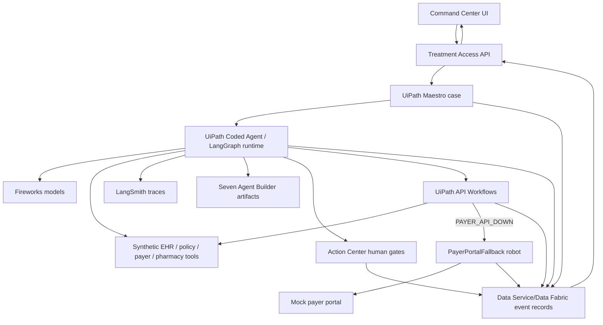

# Live Agentic Product Plan

This document turns the current local proof dashboard into a customer-facing,
live agentic product for the UiPath AgentHack submission.

## Goal

Build Treatment Access Command Center as a polished treatment-access operations
product where the UI is simple and beautiful, while UiPath, Fireworks,
LangGraph, LangSmith, agents, robots, human gates, and event records do the
complex work behind the scenes.

The current build proves the contracts. The next build should make the product
feel live: a user starts or opens a case, watches progress advance, sees clear
next-best actions, and can drill into evidence, submission, appeal, and audit
details when needed.

## Current State

What already exists:

- React Command Center and mock payer portal.
- Synthetic EHR, payer, pharmacy, denial, portal, and event mirror APIs.
- Shared TypeScript/Zod schemas.
- Deterministic seven-agent runtime and smoke tests.
- UiPath low-code agent artifacts, API workflow artifacts, Action Center
  contracts, Data Service/Data Fabric contracts, and Maestro case design
  artifacts.
- Real `PayerPortalFallback` UiPath RPA project shell that validates, builds,
  imports into the solution, and passes solution pack dry-run.

What is not live yet:

- No Fireworks model calls.
- No LangSmith traces.
- No live UiPath Agent Builder/Coded Agent execution.
- No live Action Center task creation.
- No live Data Service/Data Fabric writes.
- No live Orchestrator robot job.
- No solution upload/publish/deploy/activate.
- No fully implemented UIA robot workflow inside `PayerPortalFallback`.

## UI Direction

The UI references in `/Ui References` show the right target:

- Dark navy SaaS command center.
- Left navigation with Dashboard, Cases, Evidence, Submissions, Appeals, and
  Analytics.
- Top global search and simple user controls.
- KPI cards for case volume, delays, clinician signoffs, denials rescued, and
  approvals.
- Featured urgent case with a clear risk reason and action button.
- Active cases table with next actions.
- Case detail page with progress, actors, next-best actions, recent activity,
  and a readable patient/treatment summary.
- Evidence matrix page with source drawer and direct warning against unsupported
  claims.
- Appeal builder page with denial summary, appeal packet progress, signoff, and
  recommended actions.

### Product UI Principle

The dashboard should not look like a proof console. Judges and users should see
a product first:

1. What needs attention?
2. Why is it at risk?
3. What is the next best action?
4. What has the system already done?
5. What evidence supports the action?

Detailed orchestration proof should move into an optional case audit drawer,
activity details, or demo/debug mode.

### Proposed Screens

| Route                  | Purpose                          | Primary user question                                                      |
| ---------------------- | -------------------------------- | -------------------------------------------------------------------------- |
| `/` or `/dashboard`    | Portfolio overview               | What needs attention today?                                                |
| `/cases`               | Case queue                       | Which cases are blocked or urgent?                                         |
| `/cases/:caseId`       | Treatment case                   | Where is this case and who/what owns the next step?                        |
| `/evidence/:caseId`    | Evidence matrix                  | Do we have enough source-backed evidence to submit?                        |
| `/submissions/:caseId` | Submission status                | Was the payer submission attempted, accepted, or routed to robot fallback? |
| `/appeals/:caseId`     | Denial rescue and appeal builder | Why was it denied and what appeal packet is ready?                         |
| `/analytics`           | Outcome dashboard                | How much access delay did the automation reduce?                           |

### UI Changes To Make

- Replace the current single long proof page with routed product screens.
- Keep seven-agent visibility, but show it as involved actors, step activity,
  and expandable trace details.
- Convert the current stage strip into a customer-readable progress timeline:
  Intake, Policy Check, Evidence Mapping, Clinician Signoff, Submission, Denial,
  Appeal, Approval, Pharmacy Coordination.
- Convert the current demo toggles into a hidden or secondary "Demo controls"
  panel, not the primary product UI.
- Keep the mock payer portal utilitarian because it is an automation target, not
  the customer-facing product.

## Live Agentic Architecture

UiPath remains the orchestration and governance layer. The custom UI reads and
visualizes governed state. It may trigger a case run for local development or
demo convenience, but live case state should be written through UiPath-owned
workflows, agents, robots, human tasks, or UiPath-written event records.



## Agent Runtime Recommendation

Use a hybrid that is strong for the hackathon and still practical:

1. Keep the existing seven agent identities:
   - Coverage Requirement
   - Evidence Retrieval
   - Missing Evidence
   - Submission Packet
   - Denial Rescue
   - Appeal Packet
   - Care Continuity
   - Audit Packet remains cross-cutting.
2. Add a live model-backed runtime with `AGENT_MODE=live`.
3. Preserve deterministic mode with `AGENT_MODE=deterministic` for repeatable
   smoke tests and no-key fallback.
4. Implement the live runtime as a stateful LangGraph graph, ideally inside a
   UiPath Coded Agent scaffolded through `uip codedagent new` when we begin that
   checkpoint. This keeps UiPath central while allowing real model/tool calls.
5. Mirror every live agent node into the same shared schemas already used by the
   UI and smoke tests.

### Why LangGraph

LangGraph is a good fit because this workflow is not a single prompt. It needs
state, branching, retries, human gates, exception paths, streaming progress,
and auditable tool calls. The graph nodes map naturally to the seven agents and
to UiPath stage events.

### Why LangSmith

LangSmith should be the trace and debugging layer:

- one top-level trace per case run;
- child runs for each specialist agent;
- child spans for model calls, retrieval calls, payer API attempts, Action
  Center requests, and robot fallback requests;
- metadata including `case_id`, `agent_id`, `maestro_case_id`, `run_mode`, and
  `synthetic=true`.

## Fireworks Model Plan

Use Fireworks through its OpenAI-compatible API so we can keep model provider
code simple and switch model IDs by environment variable.

Recommended defaults:

| Use                            | Model                                                                                                                             | Why                                                                                              |
| ------------------------------ | --------------------------------------------------------------------------------------------------------------------------------- | ------------------------------------------------------------------------------------------------ |
| Tool-calling specialist agents | `accounts/fireworks/models/kimi-k2-instruct-0905` initially; upgrade to the current Kimi K2.6 model ID after account verification | Fireworks docs use Kimi K2 for tool calling and recommend the Kimi family for agentic workflows. |
| General reasoning/planning     | `accounts/fireworks/models/deepseek-v3p1` initially; test DeepSeek V4 Pro if available in the account                             | Strong reasoning baseline, documented Fireworks chat model ID, lower setup ambiguity.            |
| Fast extraction/classification | Fireworks recommended fast model from account availability, likely DeepSeek V4 Flash / MiniMax M2.5 / GPT-OSS 20B                 | Lower latency for simple normalization and labels.                                               |
| Evidence retrieval embeddings  | `fireworks/qwen3-embedding-8b`                                                                                                    | Fireworks serverless embedding model for semantic search.                                        |
| Evidence reranking             | `fireworks/qwen3-reranker-8b`                                                                                                     | Fireworks serverless reranker for selecting the best source spans.                               |

Model settings:

- Tool calls: temperature `0.0` to `0.2`.
- Evidence extraction: temperature `0.0`.
- Appeal draft: temperature `0.2` to `0.4`, but still schema-bounded and source
  constrained.
- Kimi K2 family calls should set explicit `max_tokens`.
- Long agentic calls need longer client read timeouts.

## Environment Variables

Create `.env.local` manually when we execute the live checkpoint. Do not commit
this file.

```bash
AGENT_MODE=live
AGENT_ORCHESTRATOR=uipath

FIREWORKS_API_KEY=
FIREWORKS_BASE_URL=https://api.fireworks.ai/inference/v1
FIREWORKS_AGENT_MODEL=accounts/fireworks/models/kimi-k2-instruct-0905
FIREWORKS_REASONING_MODEL=accounts/fireworks/models/deepseek-v3p1
FIREWORKS_FAST_MODEL=accounts/fireworks/models/deepseek-v3p1
FIREWORKS_EMBEDDING_MODEL=fireworks/qwen3-embedding-8b
FIREWORKS_RERANKER_MODEL=fireworks/qwen3-reranker-8b

LANGSMITH_TRACING=true
LANGSMITH_API_KEY=
LANGSMITH_PROJECT=Treatment Access Command Center
LANGCHAIN_CALLBACKS_BACKGROUND=false
```

Optional later:

```bash
LANGSMITH_ENDPOINT=
LANGSMITH_WORKSPACE_ID=
```

## Tool Design

The model should never get a vague universal tool. Tool names and schemas should
be narrow and distinct:

| Tool                               | Owner                                | Purpose                                                |
| ---------------------------------- | ------------------------------------ | ------------------------------------------------------ |
| `retrieve_payer_policy`            | Coverage Requirement                 | Load policy criteria and citations.                    |
| `retrieve_chart_artifacts`         | Evidence Retrieval                   | Load synthetic notes, labs, and medication history.    |
| `search_evidence_spans`            | Evidence Retrieval                   | Embed/rerank source spans for a criterion.             |
| `write_evidence_matrix`            | Evidence Retrieval                   | Persist schema-valid evidence rows.                    |
| `create_clinician_validation_task` | Missing Evidence / Submission Packet | Request human approval for high-impact assertions.     |
| `build_submission_packet`          | Submission Packet                    | Assemble fields and attachments only after gates pass. |
| `attempt_payer_api_submission`     | Submission Packet                    | Submit through synthetic payer API workflow.           |
| `request_portal_robot_fallback`    | Submission Packet                    | Request UiPath robot fallback only on API failure.     |
| `classify_denial`                  | Denial Rescue                        | Categorize denial reason from source text.             |
| `draft_appeal_packet`              | Appeal Packet                        | Draft source-grounded administrative appeal language.  |
| `create_appeal_signoff_task`       | Appeal Packet                        | Require clinician review before submission.            |
| `create_care_handoff`              | Care Continuity                      | Prepare pharmacy/scheduling handoff after approval.    |
| `write_audit_event`                | All agents                           | Append governed event record.                          |

Each tool call should return structured JSON that is validated with the shared
Zod schemas before it reaches the UI.

## Safety And Governance

Hard requirements:

- Synthetic data only.
- No real patient, provider, payer, credential, or PHI data.
- Every clinical assertion must have source evidence, a policy citation, or
  human approval.
- Unsupported claims must be blocked or visibly flagged.
- Appeal language is an administrative draft for clinician review.
- Human gates are required for high-impact medical assertions and appeal
  signoff.
- Robot fallback only runs against the synthetic payer portal.
- Live UiPath side effects remain approval-gated until explicitly approved.

## State Model Additions

The next checkpoint should add runtime-oriented records to the shared schema and
mock API:

- `AgentRun`: one row per full case run.
- `AgentStepRun`: one row per specialist agent/node.
- `ToolCall`: tool name, arguments hash, result summary, status, latency, trace
  link.
- `HumanGate`: Action Center task status and decision.
- `RobotJob`: Orchestrator job key, status, confirmation ID.
- `SubmissionAttempt`: channel, status, error code, confirmation.
- `TraceLink`: LangSmith trace URL or trace ID.

The UI can then render a live-feeling product without showing backend clutter by
default.

## Implementation Phases

### Phase 1 - Product UI Redesign

- Convert the Command Center into routed pages matching the references.
- Build the dashboard, case detail, evidence matrix, and appeal builder.
- Add an optional audit/trace drawer for judges.
- Keep current proof content available, but not as the default experience.

### Phase 2 - Live Agent Service

- Add Fireworks and LangSmith dependencies.
- Add provider adapter and environment validation.
- Add deterministic/live runtime switch.
- Implement model-backed specialist nodes with Zod-validated outputs.
- Record LangSmith trace IDs in the event mirror.

### Phase 3 - LangGraph Orchestration

- Build a graph with explicit stages and branch conditions:
  - policy/evidence complete -> clinician gate;
  - missing evidence -> human task;
  - payer API down -> robot fallback;
  - denial -> denial rescue and appeal;
  - approval -> care handoff.
- Stream run events to the UI.

### Phase 4 - UiPath Live Integration

- Scaffold or update a UiPath Coded Agent only through the official `uip`
  workflow.
- Wire the graph to UiPath artifacts and/or invoke it from Maestro.
- Write events to Data Service/Data Fabric when approved.
- Create Action Center tasks when approved.
- Implement and run the RPA robot fallback against the mock payer portal when
  approved.

### Phase 5 - Evidence And Demo Package

- Add screenshots/video-ready flows.
- Add a simple demo script that starts from dashboard and drills into case,
  evidence, appeal, and fallback.
- Add readiness checks for `AGENT_MODE=live`.
- Add a submission disclosure that clearly distinguishes live model/tool traces
  from approval-gated UiPath side effects.

## Manual Setup Needed Later

Before executing live mode, the user will provide:

- Fireworks API key.
- LangSmith API key.
- Optional LangSmith workspace or endpoint if the key is not in the default US
  region.
- Explicit approval before any live UiPath side-effecting operation:
  - Agent Builder/Coded Agent debug;
  - Maestro live run;
  - Action Center task creation;
  - Data Service/Data Fabric writes;
  - Orchestrator robot job start;
  - solution upload/publish/deploy/activate.

## Documentation Sources Checked

- Fireworks text models and OpenAI-compatible API:
  https://docs.fireworks.ai/guides/querying-text-models
- Fireworks model recommendations:
  https://docs.fireworks.ai/guides/recommended-models
- Fireworks tool calling:
  https://docs.fireworks.ai/guides/function-calling
- Fireworks Kimi K2 family guidance:
  https://docs.fireworks.ai/models/kimi-k2
- Fireworks embeddings and reranking:
  https://docs.fireworks.ai/guides/querying-embeddings-models
- LangSmith tracing with LangChain:
  https://docs.langchain.com/langsmith/trace-with-langchain
- LangSmith tracing for OpenAI-compatible providers:
  https://docs.langchain.com/langsmith/trace-with-openai-compatible
- LangGraph JS overview:
  https://docs.langchain.com/oss/javascript/langgraph/overview
- LangGraph JS quickstart:
  https://docs.langchain.com/oss/javascript/langgraph/quickstart
- LangChain JS structured output:
  https://docs.langchain.com/oss/javascript/langchain/structured-output
- LangGraph memory:
  https://docs.langchain.com/oss/javascript/langgraph/add-memory
- Local UiPath skills:
  `.agents/skills/uipath-skill-catalog/SKILL.md`,
  `.agents/skills/uipath-agents/SKILL.md`,
  `.agents/skills/uipath-platform/SKILL.md`.
