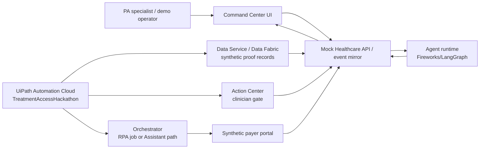

# Checkpoint 8 Live UiPath Final Execution Plan

Checkpoint 8 is the final product-readiness checkpoint. Its purpose is to close
the gap between the Checkpoint 7 local/live-proof product and the UiPath
AgentHack requirement that the solution visibly run on UiPath Automation Cloud
with UiPath as the execution and orchestration layer.

## Source Requirements

Use these source materials when implementing and reviewing Checkpoint 8:

- UiPath AgentHack overview: https://uipath-agenthack.devpost.com/
- UiPath AgentHack rules: https://uipath-agenthack.devpost.com/rules
- UiPath AgentHack resources: https://uipath-agenthack.devpost.com/resources
- UiPath Maestro docs: https://docs.uipath.com/maestro/
- UiPath Agents docs: https://docs.uipath.com/agents/
- UiPath Action Center docs: https://docs.uipath.com/action-center/
- UiPath Data Service docs: https://docs.uipath.com/data-service/
- UiPath Orchestrator docs: https://docs.uipath.com/orchestrator/
- UiPath Integration Service docs: https://docs.uipath.com/integration-service/
- Local UiPath skills under `.agents/skills`.

## Critical Analysis

The current product is strong enough for a local product demonstration but not
yet strong enough to claim full hackathon alignment. Checkpoint 7 proves the
agent runtime, Fireworks/LangSmith readiness, event mirror contract, Command
Center UX, RPA project build, and solution dry-run. The remaining gap is live
UiPath Automation Cloud execution.

The hackathon wording makes three things especially important:

1. **UiPath must execute and orchestrate**, not merely be mentioned in docs.
2. **The demo must show a running platform solution**, not only a custom UI.
3. **Track 1 should show dynamic case work** with agents, robots, people,
   exceptions, and auditability.

That does not mean we need real patient data, real payer systems, or a fully
production-hardened hospital deployment. Synthetic data and mock systems remain
correct. What must change is the source of live state: at least one visible case
transition should be created by a live UiPath platform action, and the UI should
make that provenance clear.

## Final Product Bar

Checkpoint 8 should produce a defensible final state:

- A judge can see the premium Command Center as the customer product.
- A judge can also see UiPath Automation Cloud evidence in the
  `TreatmentAccessHackathon` folder.
- A live UiPath-side action creates or owns at least one synthetic case/event
  state transition.
- The Command Center reads and displays that state as governed proof, not as a
  UI-only status change.
- Human approval is represented by a live Action Center task if available, or a
  clearly documented UiPath-controlled fallback if task creation is blocked by
  tenant permissions.
- Robot fallback is either executed as a live Orchestrator/Assistant job against
  the synthetic payer portal or documented with exact proof of why the tenant
  runtime could not run it.
- All demo claims remain synthetic, source-grounded, and safe.

## Live Proof Ladder

Use this ladder to decide what to execute. Do not skip directly to risky broad
deployment when a narrower proof satisfies the judging requirement.

| Level | Proof                                                                                                                                                                                        | Status target                 |
| ----- | -------------------------------------------------------------------------------------------------------------------------------------------------------------------------------------------- | ----------------------------- |
| H0    | Checkpoint 7 local live proof: UI, API, agents, synthetic event mirror, provider readiness.                                                                                                  | Already done.                 |
| H1    | UiPath writes synthetic event/case state through a live Cloud-side mechanism: Data Service/Data Fabric record, API Workflow/Agent/Coded Agent call, or approved CLI-mediated platform write. | Required for final.           |
| H2    | Human gate proof: live Action Center task is created/assigned/completed, or a UiPath Apps/approved fallback gate is shown and documented.                                                    | Strongly preferred.           |
| H3    | Robot proof: Orchestrator/Assistant executes `PayerPortalFallback` against the synthetic mock portal and writes confirmation back to the event mirror.                                       | Preferred if runtime permits. |
| H4    | Solution proof: solution package is published/deployed/activated in `TreatmentAccessHackathon`, or upload/publish failure is documented with the exact activation blocker.                   | Stretch, only after H1-H3.    |

Minimum acceptable final checkpoint: H1 plus either H2 or H3, with the other
path documented honestly. Ideal final checkpoint: H1 + H2 + H3, and H4 if
solution lifecycle permissions are available.

## What May Stay Synthetic

- Patient, provider, payer, diagnosis, medication, policy, and clinical
  evidence data.
- Mock EHR API.
- Mock payer API.
- Mock payer portal.
- Mock pharmacy/scheduling endpoint.
- Deterministic model prompts or deterministic fallback mode for reliable
  recording.
- Local Command Center UI, as long as it visualizes UiPath-written or
  UiPath-shaped governed state.

## What Must Not Be Faked

- A button that only changes frontend state while claiming UiPath execution.
- Screenshots that imply a task/job/deploy ran when it did not.
- A robot confirmation shown as live if no robot/job/event wrote it.
- Action Center approval shown as live if no task or documented fallback exists.
- Data Service / Orchestrator / Solution deployment claims without Cloud-side
  command evidence.
- Any real PHI, payer credential, payer submission, or medical/legal advice.

## Recommended Final Architecture



The key principle: the custom UI is the customer-facing cockpit, but UiPath is
the governed execution and evidence layer.

## Checkpoint 8 Workstreams

### 1. Cloud Proof Discovery and Safety Gates

- Reconfirm login, org, tenant, folder, folder ID/key, runtime assignment, tool
  versions, and available command surfaces.
- Discover Data Fabric/Data Service entities, Action Center users/tasks,
  processes, packages, robots/sessions, and solution lifecycle status.
- Produce a side-effect approval matrix with exact commands and expected
  rollback/reset notes.
- Do not run mutation commands without explicit approval.

### 2. UiPath-Written Event State

- Define the minimum synthetic event/case record that UiPath can write live.
- Prefer Data Service/Data Fabric if available in the folder.
- If Data Service entity creation is unavailable, use a live UiPath-controlled
  API Workflow/Coded Agent/approved CLI write to the event mirror.
- Add a verifier that distinguishes UiPath-written events from local synthetic
  events.

### 3. Human Gate Proof

- Attempt read-only Action Center discovery first.
- Prepare a live clinician-validation task creation path, preferably via
  UiPath workflow/agent/platform command rather than custom UI state.
- If task creation is blocked, record the exact permission or product blocker
  and implement a clearly labelled UiPath-controlled fallback.
- Ensure the UI can display the live task ID/deep link or fallback evidence.

### 4. Robot / Orchestrator Proof

- Use the real `PayerPortalFallback` RPA project and the synthetic portal.
- Prepare publish/deploy/job-start or Assistant-run steps.
- Confirm robot/session/runtime availability before execution.
- Capture confirmation ID and write it back through the governed event path.
- Do not use Playwright or raw DOM automation as a substitute for the robot
  proof.

### 5. Product UX, Demo Evidence, and Submission Claims

- Make the Command Center display a clear "UiPath live proof" state without
  exposing backend complexity on the main screen.
- Add a proof drawer or manifest that shows UiPath folder, task/job/record IDs,
  timestamps, source labels, and verification commands.
- Update README/submission/demo script to match what actually ran.
- Capture final screenshots/video checklist only after live proof evidence
  exists.

## Verification Expectations

No-side-effect verification before approval:

```bash
CI=true pnpm verify
CI=true pnpm format:check
CI=true pnpm smoke:checkpoint7-live-proof
CI=true pnpm uipath:readiness cloud
CI=true pnpm uipath:readiness local
git diff --check
```

Checkpoint 8 should add at least one final readiness/smoke command, for example:

```bash
CI=true pnpm smoke:checkpoint8-live-uipath
```

Live-side-effect verification after explicit approval should record:

- exact command or UiPath UI action used;
- source record/task/job/deploy identifier;
- Command Center evidence;
- rollback/reset note;
- screenshot or terminal-safe summary with no secrets.

## Stop Conditions

Stop and ask the orchestrator/user if:

- the next step creates, updates, deploys, activates, or runs a live UiPath
  resource;
- the active tenant/folder is not `TreatmentAccessHackathon`;
- a required product surface is missing after discovery/activation checks;
- a command would expose secrets or real PHI;
- a worker cannot distinguish local synthetic state from UiPath-written state;
- an attempted live proof fails in a way that changes what can be claimed in the
  demo.

## End State

After Checkpoint 8, the honest final answer should be one of:

1. **Ideal:** Live UiPath event state, Action Center gate, robot fallback, and
   solution lifecycle proof all work in Automation Cloud against synthetic
   systems.
2. **Strong:** Live UiPath event state plus either Action Center or robot proof
   works; the other path is documented with exact tenant/runtime blocker.
3. **Blocked:** Discovery proves a missing activation/permission/runtime issue
   that prevents Cloud-side execution; docs and demo wording are downgraded to
   avoid overclaiming.
